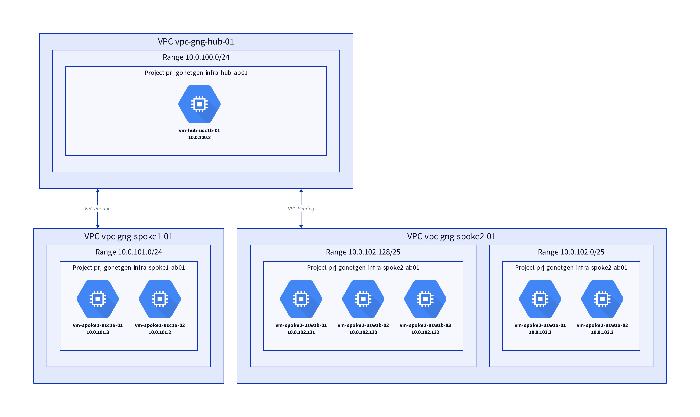

# Go Net Gen

Generate network diagrams of VMs in VPCs on Google Cloud automatically. Supports
VPC peering and Shared VPCs.

## Sample Output



## Setup

1. Create an infrastructure
   1. `cd infra`
   2. add terraform.tfvars (see the sample file)
   3. update `local.random_string_project` with a random string
   4. terraform init && terraform apply
   5. this will create 3 projects and 8 VMs (please, mind costs)
   6. you can skip these steps if you already have a service account, VMs and
      VPC
2. Download the service account key from GCP (in the hub project), it has
   Network Reader role on each project. Save it in the "secrets" folder.
3. `cd secrets && export GOOGLE_APPLICATION_CREDENTIALS="$PWD/gonetgen-sa-key.json"`
4. create a `config.toml` file (see the sample file)
5. `cd cmd/app && go run .`

Note that downloading a service account key is a bad practice in general and
should be avoided. Deploying a service on GCP, e.g. on Cloud Run, and attaching
the SA would be better.

## Resources

- [install d2](https://d2lang.com/tour/install)

D2 quick start:

```bash
echo 'x -> y' > helloworld.d2
d2 -w helloworld.d2 out.png
```

Useful:

```bash
d2 cmd/app/out.d2 out.png
```
